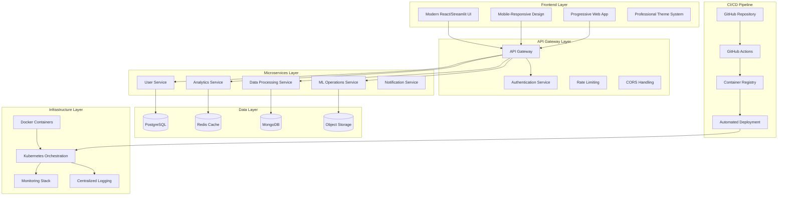
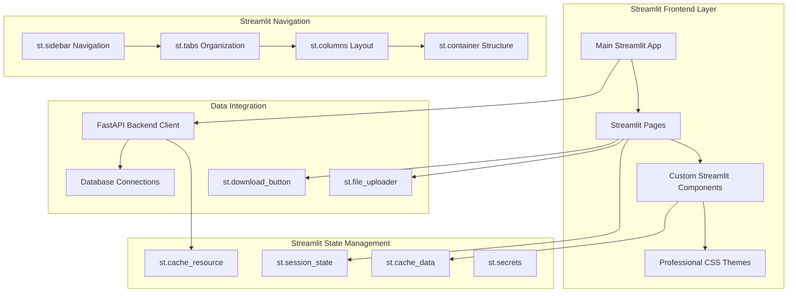

# Design Document

## Overview

This design document outlines the transformation of the existing AstralytiQ platform into an industry-grade, campus placement-ready showcase that demonstrates professional software development capabilities for SDE and Data Engineering roles. The design focuses on creating a modern, scalable, and maintainable enterprise platform that showcases technical expertise across frontend development, backend architecture, DevOps practices, and data engineering capabilities.

The enhanced platform will serve as a comprehensive portfolio piece that demonstrates proficiency in modern web technologies, cloud-native architecture, automated deployment pipelines, and enterprise-grade software engineering practices that are highly valued by recruiters and hiring managers in the technology industry.

## Architecture

### High-Level System Architecture



### Enhanced Streamlit Architecture



### Microservices Architecture Design

```mermaid
graph TB
    subgraph "User Management Domain"
        USER_API[User API]
        AUTH_SVC[Authentication Service]
        PROFILE_SVC[Profile Service]
        RBAC_SVC[RBAC Service]
    end
    
    subgraph "Data Processing Domain"
        DATA_API[Data API]
        ETL_SVC[ETL Service]
        VALIDATION_SVC[Data Validation Service]
        LINEAGE_SVC[Data Lineage Service]
    end
    
    subgraph "ML Operations Domain"
        ML_API[ML API]
        TRAINING_SVC[Model Training Service]
        INFERENCE_SVC[Model Inference Service]
        REGISTRY_SVC[Model Registry Service]
    end
    
    subgraph "Analytics Domain"
        ANALYTICS_API[Analytics API]
        METRICS_SVC[Metrics Service]
        DASHBOARD_SVC[Dashboard Service]
        REPORTING_SVC[Reporting Service]
    end
    
    subgraph "Shared Services"
        CONFIG_SVC[Configuration Service]
        NOTIFICATION_SVC[Notification Service]
        AUDIT_SVC[Audit Service]
        HEALTH_SVC[Health Check Service]
    end
    
    USER_API --> AUTH_SVC
    USER_API --> PROFILE_SVC
    USER_API --> RBAC_SVC
    
    DATA_API --> ETL_SVC
    DATA_API --> VALIDATION_SVC
    DATA_API --> LINEAGE_SVC
    
    ML_API --> TRAINING_SVC
    ML_API --> INFERENCE_SVC
    ML_API --> REGISTRY_SVC
    
    ANALYTICS_API --> METRICS_SVC
    ANALYTICS_API --> DASHBOARD_SVC
    ANALYTICS_API --> REPORTING_SVC
    
    AUTH_SVC --> CONFIG_SVC
    ETL_SVC --> NOTIFICATION_SVC
    TRAINING_SVC --> AUDIT_SVC
    METRICS_SVC --> HEALTH_SVC
```



## Components and Interfaces

### Professional Streamlit UI Components

```python
# Industry-Grade Streamlit Component System
import streamlit as st
import plotly.express as px
import plotly.graph_objects as go
from typing import Dict, List, Optional, Any
import pandas as pd

class EnterpriseStreamlitTheme:
    """Professional theme system for Streamlit applications."""
    
    ENTERPRISE_COLORS = {
        "primary": "#667eea",
        "secondary": "#764ba2", 
        "accent": "#f093fb",
        "background": "#f8fafc",
        "surface": "#ffffff",
        "text_primary": "#1a202c",
        "text_secondary": "#4a5568",
        "success": "#48bb78",
        "warning": "#ed8936",
        "error": "#f56565",
        "info": "#4299e1"
    }
    
    @classmethod
    def apply_custom_css(cls) -> None:
        """Apply professional CSS styling to Streamlit app."""
        st.markdown(f"""
        <style>
        /* Main app styling */
        .stApp {{
            background: linear-gradient(135deg, {cls.ENTERPRISE_COLORS['primary']} 0%, {cls.ENTERPRISE_COLORS['secondary']} 100%);
            font-family: 'Inter', -apple-system, BlinkMacSystemFont, 'Segoe UI', sans-serif;
        }}
        
        /* Professional sidebar */
        .css-1d391kg {{
            background: rgba(255, 255, 255, 0.95);
            backdrop-filter: blur(10px);
            border-right: 1px solid rgba(0, 0, 0, 0.1);
        }}
        
        /* Modern metric cards */
        .metric-card {{
            background: {cls.ENTERPRISE_COLORS['surface']};
            padding: 1.5rem;
            border-radius: 12px;
            box-shadow: 0 4px 6px rgba(0, 0, 0, 0.05);
            border-left: 4px solid {cls.ENTERPRISE_COLORS['primary']};
            margin: 1rem 0;
            transition: transform 0.2s ease, box-shadow 0.2s ease;
        }}
        
        .metric-card:hover {{
            transform: translateY(-2px);
            box-shadow: 0 8px 25px rgba(0, 0, 0, 0.1);
        }}
        
        /* Professional buttons */
        .stButton > button {{
            background: linear-gradient(45deg, {cls.ENTERPRISE_COLORS['primary']}, {cls.ENTERPRISE_COLORS['secondary']});
            color: white;
            border: none;
            border-radius: 8px;
            padding: 0.75rem 1.5rem;
            font-weight: 600;
            transition: all 0.2s ease;
        }}
        
        .stButton > button:hover {{
            transform: translateY(-1px);
            box-shadow: 0 4px 12px rgba(102, 126, 234, 0.4);
        }}
        
        /* Modern data tables */
        .stDataFrame {{
            border-radius: 8px;
            overflow: hidden;
            box-shadow: 0 2px 8px rgba(0, 0, 0, 0.1);
        }}
        
        /* Professional headers */
        .main-header {{
            background: {cls.ENTERPRISE_COLORS['surface']};
            padding: 2rem;
            border-radius: 12px;
            margin-bottom: 2rem;
            box-shadow: 0 2px 8px rgba(0, 0, 0, 0.05);
        }}
        
        /* Status indicators */
        .status-indicator {{
            display: inline-block;
            width: 12px;
            height: 12px;
            border-radius: 50%;
            margin-right: 8px;
        }}
        
        .status-success {{ background-color: {cls.ENTERPRISE_COLORS['success']}; }}
        .status-warning {{ background-color: {cls.ENTERPRISE_COLORS['warning']}; }}
        .status-error {{ background-color: {cls.ENTERPRISE_COLORS['error']}; }}
        .status-info {{ background-color: {cls.ENTERPRISE_COLORS['info']}; }}
        </style>
        """, unsafe_allow_html=True)

class StreamlitComponentLibrary:
    """Professional component library for Streamlit applications."""
    
    @staticmethod
    def render_enterprise_header(title: str, subtitle: str = "", user_info: Dict = None) -> None:
        """Render professional enterprise header."""
        st.markdown(f"""
        <div class="main-header">
            <h1 style="margin: 0; color: {EnterpriseStreamlitTheme.ENTERPRISE_COLORS['text_primary']};">{title}</h1>
            {f'<p style="margin: 0.5rem 0 0 0; color: {EnterpriseStreamlitTheme.ENTERPRISE_COLORS["text_secondary"]};">{subtitle}</p>' if subtitle else ''}
        </div>
        """, unsafe_allow_html=True)
        
        if user_info:
            with st.sidebar:
                st.markdown(f"""
                <div style="padding: 1rem; background: white; border-radius: 8px; margin-bottom: 1rem;">
                    <div style="display: flex; align-items: center;">
                        <div style="width: 40px; height: 40px; background: {EnterpriseStreamlitTheme.ENTERPRISE_COLORS['primary']}; 
                                    border-radius: 50%; display: flex; align-items: center; justify-content: center; 
                                    color: white; font-weight: bold; margin-right: 12px;">
                            {user_info.get('name', 'U')[0].upper()}
                        </div>
                        <div>
                            <div style="font-weight: 600; color: {EnterpriseStreamlitTheme.ENTERPRISE_COLORS['text_primary']};">
                                {user_info.get('name', 'User')}
                            </div>
                            <div style="font-size: 0.875rem; color: {EnterpriseStreamlitTheme.ENTERPRISE_COLORS['text_secondary']};">
                                {user_info.get('role', 'User')}
                            </div>
                        </div>
                    </div>
                </div>
                """, unsafe_allow_html=True)
    
    @staticmethod
    def render_metric_cards(metrics: List[Dict[str, Any]]) -> None:
        """Render professional metric cards."""
        cols = st.columns(len(metrics))
        
        for i, metric in enumerate(metrics):
            with cols[i]:
                delta_color = EnterpriseStreamlitTheme.ENTERPRISE_COLORS['success'] if metric.get('delta', 0) >= 0 else EnterpriseStreamlitTheme.ENTERPRISE_COLORS['error']
                delta_symbol = "↗" if metric.get('delta', 0) >= 0 else "↘"
                
                st.markdown(f"""
                <div class="metric-card">
                    <h3 style="margin: 0; font-size: 0.875rem; color: {EnterpriseStreamlitTheme.ENTERPRISE_COLORS['text_secondary']}; text-transform: uppercase; letter-spacing: 0.05em;">
                        {metric['title']}
                    </h3>
                    <h2 style="margin: 0.5rem 0; font-size: 2rem; font-weight: 700; color: {EnterpriseStreamlitTheme.ENTERPRISE_COLORS['text_primary']};">
                        {metric['value']}
                    </h2>
                    {f'<p style="margin: 0; font-size: 0.875rem; color: {delta_color};"><span>{delta_symbol}</span> {metric["delta"]}%</p>' if 'delta' in metric else ''}
                </div>
                """, unsafe_allow_html=True)
    
    @staticmethod
    def render_status_indicator(status: str, text: str) -> None:
        """Render status indicator with text."""
        status_class = f"status-{status.lower()}"
        st.markdown(f"""
        <div style="display: flex; align-items: center; margin: 0.5rem 0;">
            <span class="status-indicator {status_class}"></span>
            <span style="color: {EnterpriseStreamlitTheme.ENTERPRISE_COLORS['text_primary']};">{text}</span>
        </div>
        """, unsafe_allow_html=True)
    
    @staticmethod
    def render_professional_chart(data: pd.DataFrame, chart_type: str, title: str, **kwargs) -> None:
        """Render professional charts with consistent styling."""
        fig = None
        
        if chart_type == "line":
            fig = px.line(data, title=title, **kwargs)
        elif chart_type == "bar":
            fig = px.bar(data, title=title, **kwargs)
        elif chart_type == "scatter":
            fig = px.scatter(data, title=title, **kwargs)
        elif chart_type == "pie":
            fig = px.pie(data, title=title, **kwargs)
        
        if fig:
            # Apply professional styling
            fig.update_layout(
                title_font_size=20,
                title_font_color=EnterpriseStreamlitTheme.ENTERPRISE_COLORS['text_primary'],
                font_family="Inter",
                plot_bgcolor='rgba(0,0,0,0)',
                paper_bgcolor='rgba(0,0,0,0)',
                margin=dict(t=60, l=20, r=20, b=20)
            )
            
            fig.update_traces(
                marker_color=EnterpriseStreamlitTheme.ENTERPRISE_COLORS['primary']
            )
            
            st.plotly_chart(fig, use_container_width=True)

class StreamlitAuthManager:
    """Professional authentication system for Streamlit."""
    
    @staticmethod
    def initialize_session_state() -> None:
        """Initialize session state for authentication."""
        if 'authenticated' not in st.session_state:
            st.session_state.authenticated = False
        if 'user' not in st.session_state:
            st.session_state.user = None
        if 'login_attempts' not in st.session_state:
            st.session_state.login_attempts = 0
    
    @staticmethod
    def render_login_form() -> bool:
        """Render professional login form."""
        st.markdown("""
        <div style="max-width: 400px; margin: 2rem auto; padding: 2rem; 
                    background: white; border-radius: 12px; box-shadow: 0 4px 6px rgba(0, 0, 0, 0.1);">
        """, unsafe_allow_html=True)
        
        st.markdown("### 🔐 Sign In")
        st.markdown("Welcome back! Please sign in to your account.")
        
        with st.form("login_form"):
            email = st.text_input("Email", placeholder="Enter your email")
            password = st.text_input("Password", type="password", placeholder="Enter your password")
            remember_me = st.checkbox("Remember me")
            
            col1, col2 = st.columns(2)
            with col1:
                login_button = st.form_submit_button("Sign In", use_container_width=True)
            with col2:
                forgot_password = st.form_submit_button("Forgot Password?", use_container_width=True)
        
        st.markdown("</div>", unsafe_allow_html=True)
        
        if login_button:
            if StreamlitAuthManager.authenticate_user(email, password):
                st.session_state.authenticated = True
                st.session_state.user = {
                    "email": email,
                    "name": email.split("@")[0].title(),
                    "role": "Data Scientist"
                }
                st.rerun()
            else:
                st.error("Invalid credentials. Please try again.")
                st.session_state.login_attempts += 1
        
        return st.session_state.authenticated
    
    @staticmethod
    def authenticate_user(email: str, password: str) -> bool:
        """Authenticate user credentials."""
        # Demo authentication - replace with real authentication
        demo_users = {
            "demo@astralytiq.com": "demo123",
            "admin@astralytiq.com": "admin123",
            "user@astralytiq.com": "user123"
        }
        return demo_users.get(email) == password
    
    @staticmethod
    def logout() -> None:
        """Logout user and clear session state."""
        st.session_state.authenticated = False
        st.session_state.user = None
        st.rerun()

class StreamlitNavigationManager:
    """Professional navigation system for Streamlit."""
    
    @staticmethod
    def render_sidebar_navigation() -> str:
        """Render professional sidebar navigation."""
        with st.sidebar:
            st.markdown("### 📊 AstralytiQ Platform")
            
            # Navigation menu
            pages = {
                "🏠 Dashboard": "dashboard",
                "📈 Analytics": "analytics", 
                "🤖 ML Studio": "ml_studio",
                "📊 Data Management": "data_management",
                "⚙️ Settings": "settings",
                "👤 Profile": "profile"
            }
            
            selected_page = st.radio("Navigation", list(pages.keys()), label_visibility="collapsed")
            
            # User actions
            st.markdown("---")
            if st.button("🚪 Logout", use_container_width=True):
                StreamlitAuthManager.logout()
            
            # System status
            st.markdown("---")
            st.markdown("### System Status")
            StreamlitComponentLibrary.render_status_indicator("success", "All Systems Operational")
            StreamlitComponentLibrary.render_status_indicator("info", "Last Updated: 2 min ago")
            
            return pages[selected_page]

class StreamlitDashboardBuilder:
    """Professional dashboard builder for Streamlit."""
    
    @staticmethod
    def render_dashboard_page() -> None:
        """Render main dashboard page."""
        # Header
        StreamlitComponentLibrary.render_enterprise_header(
            "Executive Dashboard",
            "Real-time insights and analytics",
            st.session_state.user
        )
        
        # Key metrics
        metrics = [
            {"title": "Total Users", "value": "12,543", "delta": 12.5},
            {"title": "Revenue", "value": "$45,231", "delta": 8.2},
            {"title": "Active Projects", "value": "89", "delta": -2.1},
            {"title": "System Uptime", "value": "99.9%", "delta": 0.1}
        ]
        
        StreamlitComponentLibrary.render_metric_cards(metrics)
        
        # Charts section
        col1, col2 = st.columns(2)
        
        with col1:
            st.markdown("#### 📈 Revenue Trend")
            # Generate sample data
            dates = pd.date_range('2024-01-01', periods=30, freq='D')
            revenue_data = pd.DataFrame({
                'Date': dates,
                'Revenue': np.random.randint(1000, 5000, 30).cumsum()
            })
            StreamlitComponentLibrary.render_professional_chart(
                revenue_data, "line", "Daily Revenue", x="Date", y="Revenue"
            )
        
        with col2:
            st.markdown("#### 👥 User Distribution")
            user_data = pd.DataFrame({
                'Category': ['Free', 'Premium', 'Enterprise'],
                'Count': [7543, 3200, 1800]
            })
            StreamlitComponentLibrary.render_professional_chart(
                user_data, "pie", "User Categories", names="Category", values="Count"
            )
        
        # Recent activity
        st.markdown("#### 🔄 Recent Activity")
        activity_data = pd.DataFrame({
            'Time': ['2 min ago', '5 min ago', '12 min ago', '1 hour ago'],
            'User': ['john.doe@company.com', 'jane.smith@startup.io', 'admin@astralytiq.com', 'data.scientist@corp.com'],
            'Action': ['Created new project', 'Uploaded dataset', 'System maintenance', 'Model training completed'],
            'Status': ['Success', 'Success', 'Info', 'Success']
        })
        
        for _, row in activity_data.iterrows():
            col1, col2, col3, col4 = st.columns([2, 3, 4, 1])
            with col1:
                st.text(row['Time'])
            with col2:
                st.text(row['User'])
            with col3:
                st.text(row['Action'])
            with col4:
                StreamlitComponentLibrary.render_status_indicator(row['Status'].lower(), "")

# Main Application Structure
def main():
    """Main Streamlit application."""
    st.set_page_config(
        page_title="AstralytiQ - Enterprise MLOps Platform",
        page_icon="🚀",
        layout="wide",
        initial_sidebar_state="expanded"
    )
    
    # Apply professional theme
    EnterpriseStreamlitTheme.apply_custom_css()
    
    # Initialize authentication
    StreamlitAuthManager.initialize_session_state()
    
    # Check authentication
    if not st.session_state.authenticated:
        if not StreamlitAuthManager.render_login_form():
            st.stop()
    
    # Render main application
    current_page = StreamlitNavigationManager.render_sidebar_navigation()
    
    if current_page == "dashboard":
        StreamlitDashboardBuilder.render_dashboard_page()
    elif current_page == "analytics":
        render_analytics_page()
    elif current_page == "ml_studio":
        render_ml_studio_page()
    elif current_page == "data_management":
        render_data_management_page()
    elif current_page == "settings":
        render_settings_page()
    elif current_page == "profile":
        render_profile_page()

if __name__ == "__main__":
    main()
```

### Streamlit Performance Optimization

```python
# Advanced Streamlit Caching and Performance
import streamlit as st
import pandas as pd
import numpy as np
from typing import Any, Dict, List
import time
import hashlib

class StreamlitPerformanceManager:
    """Optimize Streamlit application performance."""
    
    @staticmethod
    @st.cache_data(ttl=3600)  # Cache for 1 hour
    def load_large_dataset(file_path: str) -> pd.DataFrame:
        """Load and cache large datasets."""
        return pd.read_csv(file_path)
    
    @staticmethod
    @st.cache_data(ttl=1800)  # Cache for 30 minutes
    def process_analytics_data(data: pd.DataFrame, filters: Dict[str, Any]) -> pd.DataFrame:
        """Process analytics data with caching."""
        # Apply filters
        filtered_data = data.copy()
        for column, value in filters.items():
            if value:
                filtered_data = filtered_data[filtered_data[column] == value]
        
        # Perform aggregations
        return filtered_data.groupby('category').agg({
            'value': ['sum', 'mean', 'count'],
            'date': ['min', 'max']
        }).round(2)
    
    @staticmethod
    @st.cache_resource
    def initialize_ml_model():
        """Initialize and cache ML models."""
        # Simulate model loading
        time.sleep(2)  # Simulate loading time
        return {"model": "trained_model", "version": "1.0.0"}
    
    @staticmethod
    def optimize_dataframe_display(df: pd.DataFrame, max_rows: int = 1000) -> pd.DataFrame:
        """Optimize dataframe display for large datasets."""
        if len(df) > max_rows:
            st.warning(f"Showing first {max_rows} rows of {len(df)} total rows")
            return df.head(max_rows)
        return df
    
    @staticmethod
    def create_pagination(data: pd.DataFrame, page_size: int = 50) -> pd.DataFrame:
        """Create pagination for large datasets."""
        if 'page_number' not in st.session_state:
            st.session_state.page_number = 0
        
        total_pages = len(data) // page_size + (1 if len(data) % page_size > 0 else 0)
        
        col1, col2, col3 = st.columns([1, 2, 1])
        
        with col1:
            if st.button("← Previous") and st.session_state.page_number > 0:
                st.session_state.page_number -= 1
                st.rerun()
        
        with col2:
            st.write(f"Page {st.session_state.page_number + 1} of {total_pages}")
        
        with col3:
            if st.button("Next →") and st.session_state.page_number < total_pages - 1:
                st.session_state.page_number += 1
                st.rerun()
        
        start_idx = st.session_state.page_number * page_size
        end_idx = start_idx + page_size
        return data.iloc[start_idx:end_idx]

class StreamlitStateManager:
    """Advanced session state management for Streamlit."""
    
    @staticmethod
    def initialize_app_state():
        """Initialize application state."""
        default_state = {
            'current_page': 'dashboard',
            'user_preferences': {
                'theme': 'light',
                'language': 'en',
                'timezone': 'UTC'
            },
            'filters': {},
            'selected_items': [],
            'form_data': {},
            'notifications': []
        }
        
        for key, value in default_state.items():
            if key not in st.session_state:
                st.session_state[key] = value
    
    @staticmethod
    def save_user_preferences(preferences: Dict[str, Any]):
        """Save user preferences to session state."""
        st.session_state.user_preferences.update(preferences)
        # In production, save to database
        st.success("Preferences saved successfully!")
    
    @staticmethod
    def add_notification(message: str, type: str = "info"):
        """Add notification to session state."""
        notification = {
            'id': hashlib.md5(f"{message}{time.time()}".encode()).hexdigest()[:8],
            'message': message,
            'type': type,
            'timestamp': time.time()
        }
        st.session_state.notifications.append(notification)
    
    @staticmethod
    def display_notifications():
        """Display notifications from session state."""
        if st.session_state.notifications:
            for notification in st.session_state.notifications[:]:
                if notification['type'] == 'success':
                    st.success(notification['message'])
                elif notification['type'] == 'error':
                    st.error(notification['message'])
                elif notification['type'] == 'warning':
                    st.warning(notification['message'])
                else:
                    st.info(notification['message'])
                
                # Remove old notifications (older than 5 seconds)
                if time.time() - notification['timestamp'] > 5:
                    st.session_state.notifications.remove(notification)

class StreamlitResponsiveDesign:
    """Implement responsive design patterns in Streamlit."""
    
    @staticmethod
    def get_screen_size() -> str:
        """Detect screen size category."""
        # This is a simplified approach - in practice, you'd use JavaScript
        # For now, we'll use container width as a proxy
        return "desktop"  # Default assumption
    
    @staticmethod
    def create_responsive_layout(content_blocks: List[Dict[str, Any]]):
        """Create responsive layout based on screen size."""
        screen_size = StreamlitResponsiveDesign.get_screen_size()
        
        if screen_size == "mobile":
            # Single column layout for mobile
            for block in content_blocks:
                st.markdown(f"### {block['title']}")
                block['render_function']()
        
        elif screen_size == "tablet":
            # Two column layout for tablet
            for i in range(0, len(content_blocks), 2):
                cols = st.columns(2)
                for j, col in enumerate(cols):
                    if i + j < len(content_blocks):
                        with col:
                            block = content_blocks[i + j]
                            st.markdown(f"### {block['title']}")
                            block['render_function']()
        
        else:  # desktop
            # Multi-column layout for desktop
            cols = st.columns(len(content_blocks))
            for i, (col, block) in enumerate(zip(cols, content_blocks)):
                with col:
                    st.markdown(f"### {block['title']}")
                    block['render_function']()
    
    @staticmethod
    def render_mobile_navigation():
        """Render mobile-friendly navigation."""
        with st.expander("📱 Navigation Menu"):
            pages = ["Dashboard", "Analytics", "ML Studio", "Data Management", "Settings"]
            selected = st.selectbox("Go to page:", pages, label_visibility="collapsed")
            return selected.lower().replace(" ", "_")
    
    @staticmethod
    def render_responsive_metrics(metrics: List[Dict[str, Any]]):
        """Render metrics with responsive layout."""
        screen_size = StreamlitResponsiveDesign.get_screen_size()
        
        if screen_size == "mobile":
            # Stack metrics vertically on mobile
            for metric in metrics:
                st.metric(
                    label=metric['label'],
                    value=metric['value'],
                    delta=metric.get('delta')
                )
        else:
            # Use columns for larger screens
            cols = st.columns(len(metrics))
            for col, metric in zip(cols, metrics):
                with col:
                    st.metric(
                        label=metric['label'],
                        value=metric['value'],
                        delta=metric.get('delta')
                    )
```

### Data Processing Architecture

```typescript
// ETL Pipeline Service
interface ETLService {
  createPipeline(config: PipelineConfig): Promise<Pipeline>;
  executePipeline(pipelineId: string, data: any): Promise<PipelineResult>;
  schedulePipeline(pipelineId: string, schedule: CronSchedule): Promise<void>;
  monitorPipeline(pipelineId: string): Promise<PipelineStatus>;
  getPipelineMetrics(pipelineId: string): Promise<PipelineMetrics>;
  validateData(data: any, schema: DataSchema): Promise<ValidationResult>;
  transformData(data: any, transformations: Transformation[]): Promise<any>;
  loadData(data: any, destination: DataDestination): Promise<LoadResult>;
}

interface PipelineConfig {
  name: string;
  description: string;
  source: DataSource;
  transformations: Transformation[];
  destination: DataDestination;
  schedule?: CronSchedule;
  retryPolicy: RetryPolicy;
  notifications: NotificationConfig[];
}

interface DataSource {
  type: 'database' | 'api' | 'file' | 'stream';
  connection: ConnectionConfig;
  query?: string;
  format?: 'json' | 'csv' | 'parquet' | 'avro';
}

interface Transformation {
  type: 'filter' | 'map' | 'aggregate' | 'join' | 'custom';
  config: TransformationConfig;
  order: number;
}

// Data Quality and Validation
interface DataQualityService {
  validateSchema(data: any, schema: DataSchema): Promise<ValidationResult>;
  checkDataQuality(data: any, rules: QualityRule[]): Promise<QualityReport>;
  detectAnomalies(data: any, model: AnomalyModel): Promise<AnomalyResult>;
  generateDataProfile(data: any): Promise<DataProfile>;
  monitorDataDrift(current: any, baseline: any): Promise<DriftReport>;
}

interface QualityRule {
  name: string;
  type: 'completeness' | 'uniqueness' | 'validity' | 'consistency' | 'accuracy';
  condition: string;
  threshold: number;
  severity: 'low' | 'medium' | 'high' | 'critical';
}
```

### ML Operations Service

```typescript
// Machine Learning Operations Service
interface MLOpsService {
  trainModel(config: TrainingConfig): Promise<TrainingJob>;
  deployModel(modelId: string, config: DeploymentConfig): Promise<ModelEndpoint>;
  predictBatch(modelId: string, data: any[]): Promise<PredictionResult[]>;
  predictRealtime(modelId: string, data: any): Promise<PredictionResult>;
  monitorModel(modelId: string): Promise<ModelMetrics>;
  retrainModel(modelId: string, newData: any): Promise<TrainingJob>;
  compareModels(modelIds: string[]): Promise<ModelComparison>;
  explainPrediction(modelId: string, data: any): Promise<ExplanationResult>;
}

interface TrainingConfig {
  algorithm: string;
  hyperparameters: Record<string, any>;
  trainingData: DataSource;
  validationData: DataSource;
  features: string[];
  target: string;
  evaluationMetrics: string[];
  crossValidation: CrossValidationConfig;
}

interface ModelEndpoint {
  id: string;
  modelId: string;
  url: string;
  status: 'deploying' | 'active' | 'inactive' | 'failed';
  version: string;
  scalingConfig: ScalingConfig;
  monitoring: MonitoringConfig;
}

// Model Registry Service
interface ModelRegistryService {
  registerModel(model: ModelMetadata): Promise<string>;
  getModel(modelId: string): Promise<ModelMetadata>;
  listModels(filters?: ModelFilters): Promise<ModelMetadata[]>;
  updateModel(modelId: string, updates: Partial<ModelMetadata>): Promise<void>;
  deleteModel(modelId: string): Promise<void>;
  promoteModel(modelId: string, stage: ModelStage): Promise<void>;
  compareModelVersions(modelId: string, versions: string[]): Promise<ModelComparison>;
}

interface ModelMetadata {
  id: string;
  name: string;
  version: string;
  algorithm: string;
  framework: string;
  metrics: ModelMetrics;
  artifacts: ModelArtifact[];
  stage: ModelStage;
  tags: string[];
  description: string;
  createdAt: Date;
  updatedAt: Date;
}
```

### CI/CD Pipeline Architecture

```yaml
# GitHub Actions Workflow Configuration
name: Industry-Grade CI/CD Pipeline

on:
  push:
    branches: [main, develop]
  pull_request:
    branches: [main]
  release:
    types: [published]

env:
  REGISTRY: ghcr.io
  IMAGE_NAME: ${{ github.repository }}

jobs:
  # Code Quality and Security Checks
  quality-checks:
    runs-on: ubuntu-latest
    steps:
      - name: Checkout code
        uses: actions/checkout@v4
        
      - name: Setup Node.js
        uses: actions/setup-node@v4
        with:
          node-version: '18'
          cache: 'npm'
          
      - name: Install dependencies
        run: npm ci
        
      - name: Run ESLint
        run: npm run lint
        
      - name: Run Prettier
        run: npm run format:check
        
      - name: Run TypeScript checks
        run: npm run type-check
        
      - name: Security audit
        run: npm audit --audit-level high
        
      - name: SAST scanning
        uses: github/codeql-action/init@v3
        with:
          languages: javascript, typescript
          
      - name: Perform CodeQL Analysis
        uses: github/codeql-action/analyze@v3

  # Comprehensive Testing Suite
  testing:
    runs-on: ubuntu-latest
    needs: quality-checks
    strategy:
      matrix:
        test-type: [unit, integration, e2e]
    steps:
      - name: Checkout code
        uses: actions/checkout@v4
        
      - name: Setup test environment
        run: |
          docker-compose -f docker-compose.test.yml up -d
          sleep 30
          
      - name: Run ${{ matrix.test-type }} tests
        run: npm run test:${{ matrix.test-type }}
        
      - name: Upload test results
        uses: actions/upload-artifact@v4
        with:
          name: test-results-${{ matrix.test-type }}
          path: coverage/
          
      - name: Upload coverage to Codecov
        uses: codecov/codecov-action@v4
        with:
          file: ./coverage/lcov.info

  # Container Build and Security Scanning
  build-and-scan:
    runs-on: ubuntu-latest
    needs: testing
    outputs:
      image-digest: ${{ steps.build.outputs.digest }}
    steps:
      - name: Checkout code
        uses: actions/checkout@v4
        
      - name: Set up Docker Buildx
        uses: docker/setup-buildx-action@v3
        
      - name: Log in to Container Registry
        uses: docker/login-action@v3
        with:
          registry: ${{ env.REGISTRY }}
          username: ${{ github.actor }}
          password: ${{ secrets.GITHUB_TOKEN }}
          
      - name: Extract metadata
        id: meta
        uses: docker/metadata-action@v5
        with:
          images: ${{ env.REGISTRY }}/${{ env.IMAGE_NAME }}
          tags: |
            type=ref,event=branch
            type=ref,event=pr
            type=semver,pattern={{version}}
            type=semver,pattern={{major}}.{{minor}}
            
      - name: Build and push Docker image
        id: build
        uses: docker/build-push-action@v5
        with:
          context: .
          platforms: linux/amd64,linux/arm64
          push: true
          tags: ${{ steps.meta.outputs.tags }}
          labels: ${{ steps.meta.outputs.labels }}
          cache-from: type=gha
          cache-to: type=gha,mode=max
          
      - name: Run Trivy vulnerability scanner
        uses: aquasecurity/trivy-action@master
        with:
          image-ref: ${{ env.REGISTRY }}/${{ env.IMAGE_NAME }}:${{ github.sha }}
          format: 'sarif'
          output: 'trivy-results.sarif'
          
      - name: Upload Trivy scan results
        uses: github/codeql-action/upload-sarif@v3
        with:
          sarif_file: 'trivy-results.sarif'

  # Deployment to Staging
  deploy-staging:
    runs-on: ubuntu-latest
    needs: build-and-scan
    if: github.ref == 'refs/heads/develop'
    environment: staging
    steps:
      - name: Deploy to staging
        run: |
          echo "Deploying to staging environment"
          # Deployment logic here
          
      - name: Run smoke tests
        run: |
          echo "Running smoke tests"
          # Smoke test logic here
          
      - name: Notify deployment
        uses: 8398a7/action-slack@v3
        with:
          status: ${{ job.status }}
          channel: '#deployments'
        env:
          SLACK_WEBHOOK_URL: ${{ secrets.SLACK_WEBHOOK }}

  # Production Deployment
  deploy-production:
    runs-on: ubuntu-latest
    needs: build-and-scan
    if: github.ref == 'refs/heads/main'
    environment: production
    steps:
      - name: Deploy to production
        run: |
          echo "Deploying to production environment"
          # Production deployment logic here
          
      - name: Run health checks
        run: |
          echo "Running production health checks"
          # Health check logic here
          
      - name: Update deployment status
        run: |
          echo "Updating deployment status"
          # Status update logic here
```

### Monitoring and Observability

```typescript
// Comprehensive Monitoring Service
interface MonitoringService {
  collectMetrics(service: string, metrics: Metric[]): Promise<void>;
  createAlert(config: AlertConfig): Promise<string>;
  getSystemHealth(): Promise<HealthStatus>;
  getPerformanceMetrics(timeRange: TimeRange): Promise<PerformanceData>;
  trackUserActivity(userId: string, activity: UserActivity): Promise<void>;
  generateReport(type: ReportType, config: ReportConfig): Promise<Report>;
  getDashboard(dashboardId: string): Promise<Dashboard>;
  createCustomDashboard(config: DashboardConfig): Promise<Dashboard>;
}

interface Metric {
  name: string;
  value: number;
  timestamp: Date;
  tags: Record<string, string>;
  unit: string;
}

interface AlertConfig {
  name: string;
  condition: string;
  threshold: number;
  severity: 'low' | 'medium' | 'high' | 'critical';
  channels: NotificationChannel[];
  cooldown: number;
}

// Application Performance Monitoring
interface APMService {
  startTrace(operationName: string): Span;
  finishTrace(span: Span): void;
  recordError(error: Error, context?: Record<string, any>): void;
  recordCustomEvent(eventName: string, properties: Record<string, any>): void;
  setUserContext(user: User): void;
  addBreadcrumb(breadcrumb: Breadcrumb): void;
  captureException(exception: Error): void;
  measurePerformance(name: string, fn: () => Promise<any>): Promise<any>;
}

// Log Management Service
interface LoggingService {
  log(level: LogLevel, message: string, context?: LogContext): void;
  debug(message: string, context?: LogContext): void;
  info(message: string, context?: LogContext): void;
  warn(message: string, context?: LogContext): void;
  error(message: string, error?: Error, context?: LogContext): void;
  fatal(message: string, error?: Error, context?: LogContext): void;
  createLogger(service: string): Logger;
  setLogLevel(level: LogLevel): void;
  addTransport(transport: LogTransport): void;
}

interface LogContext {
  userId?: string;
  requestId?: string;
  sessionId?: string;
  traceId?: string;
  metadata?: Record<string, any>;
}
```

## Data Models

### User Management Models

```typescript
// User Domain Models
interface User {
  id: string;
  email: string;
  username: string;
  firstName: string;
  lastName: string;
  avatar?: string;
  role: UserRole;
  permissions: Permission[];
  profile: UserProfile;
  preferences: UserPreferences;
  status: UserStatus;
  createdAt: Date;
  updatedAt: Date;
  lastLoginAt?: Date;
  emailVerifiedAt?: Date;
  twoFactorEnabled: boolean;
}

interface UserProfile {
  bio?: string;
  company?: string;
  position?: string;
  location?: string;
  website?: string;
  socialLinks: SocialLink[];
  skills: string[];
  interests: string[];
  timezone: string;
  language: string;
}

interface UserPreferences {
  theme: 'light' | 'dark' | 'auto';
  notifications: NotificationPreferences;
  dashboard: DashboardPreferences;
  privacy: PrivacySettings;
}

// Authentication Models
interface AuthToken {
  accessToken: string;
  refreshToken: string;
  tokenType: 'Bearer';
  expiresIn: number;
  scope: string[];
}

interface Session {
  id: string;
  userId: string;
  deviceInfo: DeviceInfo;
  ipAddress: string;
  userAgent: string;
  createdAt: Date;
  lastActivityAt: Date;
  expiresAt: Date;
  isActive: boolean;
}
```

### Data Processing Models

```typescript
// Data Pipeline Models
interface Pipeline {
  id: string;
  name: string;
  description: string;
  version: string;
  status: PipelineStatus;
  config: PipelineConfig;
  schedule?: CronSchedule;
  lastRun?: PipelineRun;
  metrics: PipelineMetrics;
  createdBy: string;
  createdAt: Date;
  updatedAt: Date;
}

interface PipelineRun {
  id: string;
  pipelineId: string;
  status: RunStatus;
  startedAt: Date;
  completedAt?: Date;
  duration?: number;
  recordsProcessed: number;
  recordsSucceeded: number;
  recordsFailed: number;
  logs: LogEntry[];
  metrics: RunMetrics;
  error?: ErrorInfo;
}

interface DataSchema {
  name: string;
  version: string;
  fields: SchemaField[];
  constraints: SchemaConstraint[];
  metadata: Record<string, any>;
}

interface SchemaField {
  name: string;
  type: DataType;
  nullable: boolean;
  description?: string;
  constraints?: FieldConstraint[];
  defaultValue?: any;
}

// Data Quality Models
interface QualityReport {
  id: string;
  datasetId: string;
  timestamp: Date;
  overallScore: number;
  dimensions: QualityDimension[];
  issues: QualityIssue[];
  recommendations: string[];
}

interface QualityDimension {
  name: string;
  score: number;
  weight: number;
  rules: QualityRule[];
  status: 'passed' | 'warning' | 'failed';
}
```

### ML Operations Models

```typescript
// Machine Learning Models
interface MLModel {
  id: string;
  name: string;
  version: string;
  algorithm: string;
  framework: string;
  status: ModelStatus;
  stage: ModelStage;
  metrics: ModelMetrics;
  hyperparameters: Record<string, any>;
  features: Feature[];
  target: string;
  artifacts: ModelArtifact[];
  experiments: Experiment[];
  deployments: ModelDeployment[];
  createdBy: string;
  createdAt: Date;
  updatedAt: Date;
}

interface Experiment {
  id: string;
  name: string;
  modelId: string;
  parameters: Record<string, any>;
  metrics: ExperimentMetrics;
  artifacts: Artifact[];
  status: ExperimentStatus;
  startedAt: Date;
  completedAt?: Date;
  notes?: string;
}

interface ModelDeployment {
  id: string;
  modelId: string;
  version: string;
  environment: DeploymentEnvironment;
  endpoint: string;
  status: DeploymentStatus;
  config: DeploymentConfig;
  metrics: DeploymentMetrics;
  deployedAt: Date;
  lastHealthCheck?: Date;
}

// Prediction Models
interface PredictionRequest {
  modelId: string;
  data: Record<string, any>;
  options?: PredictionOptions;
  metadata?: Record<string, any>;
}

interface PredictionResult {
  id: string;
  modelId: string;
  prediction: any;
  confidence?: number;
  probability?: number[];
  explanation?: ExplanationResult;
  processingTime: number;
  timestamp: Date;
}
```

Now I'll continue with the correctness properties section. Let me use the prework tool to analyze the acceptance criteria:

<function_calls>
<invoke name="prework">
<parameter name="featureName">industry-grade-platform

## Correctness Properties

*A property is a characteristic or behavior that should hold true across all valid executions of a system—essentially, a formal statement about what the system should do. Properties serve as the bridge between human-readable specifications and machine-verifiable correctness guarantees.*

Based on the prework analysis of the acceptance criteria, I'll now create correctness properties that can be validated through property-based testing:

### UI/UX Properties

**Property 1: Design System Consistency**
*For any* UI component rendered in the application, the component should use design tokens from the established design system and maintain visual consistency across all instances.
**Validates: Requirements 1.1, 1.4**

**Property 2: Responsive Layout Adaptation**
*For any* screen size within the supported range (320px to 2560px width), all UI layouts should adapt appropriately without horizontal scrolling or content overflow.
**Validates: Requirements 1.2**

**Property 3: Interactive Element Performance**
*For any* user interaction (click, hover, focus), the corresponding animation or transition should complete within 300ms and provide appropriate visual feedback.
**Validates: Requirements 1.3**

**Property 4: Navigation Flow Consistency**
*For any* valid user journey through the application, navigation should be logical, accessible, and maintain consistent patterns across all pages.
**Validates: Requirements 1.5**

### Architecture Properties

**Property 5: Service Separation Integrity**
*For any* microservice in the system, the service should have clear boundaries, minimal coupling, and well-defined interfaces with other services.
**Validates: Requirements 2.1**

**Property 6: Design Pattern Implementation**
*For any* code module implementing a design pattern (Repository, Factory, Observer), the implementation should correctly follow the pattern's structure and behavior.
**Validates: Requirements 2.2**

**Property 7: Error Handling Completeness**
*For any* error condition that occurs in the system, the error should be properly caught, logged with appropriate context, and handled gracefully without system failure.
**Validates: Requirements 2.3**

**Property 8: Caching Effectiveness**
*For any* cacheable operation, the caching mechanism should improve performance by at least 50% on subsequent requests and maintain data consistency.
**Validates: Requirements 2.4**

**Property 9: SOLID Principles Adherence**
*For any* class or module in the codebase, the code should demonstrate adherence to SOLID principles through proper abstraction, dependency injection, and single responsibility.
**Validates: Requirements 2.5**

### CI/CD Pipeline Properties

**Property 10: Automated Test Execution**
*For any* code commit to the repository, the CI/CD pipeline should automatically execute the complete test suite and prevent deployment if tests fail.
**Validates: Requirements 3.1**

**Property 11: Code Quality Gate Enforcement**
*For any* code submission, the pipeline should enforce quality gates (linting, formatting, security scanning) and block deployment if quality standards are not met.
**Validates: Requirements 3.2**

**Property 12: Deployment Automation Reliability**
*For any* successful test run on the main branch, the system should automatically deploy to the appropriate environment without manual intervention.
**Validates: Requirements 3.3**

**Property 13: Rollback Capability**
*For any* failed deployment, the system should be able to automatically rollback to the previous stable version within 5 minutes.
**Validates: Requirements 3.4**

**Property 14: Deployment Notification Accuracy**
*For any* deployment event (success, failure, rollback), appropriate notifications should be sent to configured channels with accurate status information.
**Validates: Requirements 3.5**

### Documentation Properties

**Property 15: API Documentation Completeness**
*For any* API endpoint in the system, the endpoint should be documented with request/response schemas, examples, and error codes.
**Validates: Requirements 4.2**

### Performance Properties

**Property 16: Page Load Performance**
*For any* page in the application under normal load conditions, the page should load completely within 2 seconds.
**Validates: Requirements 10.1**

**Property 17: Concurrent User Handling**
*For any* number of concurrent users up to the system limit, the application should maintain response times within acceptable thresholds without degradation.
**Validates: Requirements 10.2**

**Property 18: Cache Hit Rate Optimization**
*For any* frequently accessed data, the caching system should achieve at least 80% cache hit rate and reduce database load accordingly.
**Validates: Requirements 10.3**

**Property 19: Performance Metrics Collection**
*For any* system operation, relevant performance metrics should be collected, stored, and made available for monitoring and analysis.
**Validates: Requirements 10.4**

**Property 20: Horizontal Scaling Response**
*For any* increase in system load beyond current capacity, the system should automatically scale horizontally and distribute load effectively.
**Validates: Requirements 10.5**

### Security Properties

**Property 21: Authentication Enforcement**
*For any* protected resource access attempt, the system should verify valid authentication credentials and reject unauthorized requests.
**Validates: Requirements 11.1**

**Property 22: Input Validation Protection**
*For any* user input received by the system, the input should be validated and sanitized to prevent injection attacks and malicious code execution.
**Validates: Requirements 11.2**

**Property 23: HTTPS Communication Enforcement**
*For any* communication between client and server, the connection should use HTTPS encryption and reject insecure HTTP requests.
**Validates: Requirements 11.3**

**Property 24: Session Security Management**
*For any* user session, the session should be properly managed with secure tokens, appropriate timeouts, and protection against session hijacking.
**Validates: Requirements 11.4**

**Property 25: Security Scanning Integration**
*For any* code deployment, security vulnerability scans should be performed and deployment should be blocked if critical vulnerabilities are detected.
**Validates: Requirements 11.5**

### Monitoring Properties

**Property 26: Comprehensive Logging Coverage**
*For any* significant system event (user actions, errors, performance issues), the event should be logged with appropriate detail and context for debugging and audit purposes.
**Validates: Requirements 12.1**

**Property 27: Health Check Responsiveness**
*For any* health check request, the system should respond within 1 second with accurate status information about system components.
**Validates: Requirements 12.2**

**Property 28: Error Tracking and Alerting**
*For any* system error or exception, the error should be tracked, categorized, and trigger appropriate alerts based on severity level.
**Validates: Requirements 12.3**

**Property 29: Performance Dashboard Accuracy**
*For any* performance metric displayed on dashboards, the metric should accurately reflect current system performance with no more than 30 seconds delay.
**Validates: Requirements 12.4**

**Property 30: System Status Monitoring**
*For any* system component, the monitoring system should continuously track uptime, performance, and availability with 99.9% accuracy.
**Validates: Requirements 12.5**

### Data Engineering Properties

**Property 31: ETL Pipeline Reliability**
*For any* data processing pipeline execution, the pipeline should process data correctly, handle errors gracefully, and maintain data integrity throughout the process.
**Validates: Requirements 7.1**

**Property 32: Data Visualization Accuracy**
*For any* data visualization or dashboard, the displayed information should accurately represent the underlying data with proper aggregations and calculations.
**Validates: Requirements 7.2**

**Property 33: Database Query Optimization**
*For any* database query executed by the system, the query should be optimized for performance and use appropriate indexes and query patterns.
**Validates: Requirements 7.3**

**Property 34: Data Quality Validation**
*For any* data entering the system, the data should be validated against quality rules and rejected or flagged if it doesn't meet quality standards.
**Validates: Requirements 7.4**

**Property 35: Big Data Processing Scalability**
*For any* large dataset processing operation, the system should handle the data efficiently using appropriate big data processing techniques and frameworks.
**Validates: Requirements 7.5**

## Error Handling Strategy

### Graceful Degradation Framework

```typescript
interface ErrorHandlingStrategy {
  // Circuit Breaker Pattern Implementation
  circuitBreaker: {
    failureThreshold: number;
    recoveryTimeout: number;
    monitoringWindow: number;
  };
  
  // Retry Logic with Exponential Backoff
  retryPolicy: {
    maxRetries: number;
    baseDelay: number;
    maxDelay: number;
    backoffMultiplier: number;
  };
  
  // Fallback Mechanisms
  fallbackStrategies: {
    databaseUnavailable: () => Promise<CachedData>;
    apiTimeout: () => Promise<LocalProcessingResult>;
    authenticationFailure: () => Promise<DemoModeAccess>;
    serviceUnavailable: () => Promise<GracefulDegradation>;
  };
  
  // Error Recovery Procedures
  recoveryProcedures: {
    automaticRecovery: boolean;
    manualIntervention: boolean;
    escalationPath: string[];
    notificationChannels: NotificationChannel[];
  };
}

// Comprehensive Error Classification
enum ErrorSeverity {
  LOW = 'low',
  MEDIUM = 'medium',
  HIGH = 'high',
  CRITICAL = 'critical'
}

enum ErrorCategory {
  VALIDATION = 'validation',
  AUTHENTICATION = 'authentication',
  AUTHORIZATION = 'authorization',
  NETWORK = 'network',
  DATABASE = 'database',
  EXTERNAL_SERVICE = 'external_service',
  SYSTEM = 'system',
  USER_INPUT = 'user_input'
}

interface ErrorContext {
  userId?: string;
  sessionId?: string;
  requestId?: string;
  timestamp: Date;
  userAgent?: string;
  ipAddress?: string;
  route?: string;
  method?: string;
  payload?: any;
  stackTrace?: string;
}

// User-Friendly Error Presentation
class UserErrorHandler {
  static presentError(error: ApplicationError): UserErrorResponse {
    const userFriendlyMessages = {
      [ErrorCategory.VALIDATION]: {
        title: "Input Validation Error",
        message: "Please check your input and try again.",
        action: "Review the highlighted fields and correct any errors."
      },
      [ErrorCategory.AUTHENTICATION]: {
        title: "Authentication Required",
        message: "Please log in to access this feature.",
        action: "Sign in with your credentials or create a new account."
      },
      [ErrorCategory.NETWORK]: {
        title: "Connection Issue",
        message: "We're having trouble connecting to our servers.",
        action: "Please check your internet connection and try again."
      },
      [ErrorCategory.DATABASE]: {
        title: "Data Access Issue",
        message: "We're experiencing temporary data access issues.",
        action: "Please try again in a few moments."
      }
    };

    return {
      ...userFriendlyMessages[error.category],
      severity: error.severity,
      canRetry: error.retryable,
      supportReference: error.id
    };
  }
}
```

### Monitoring and Alerting Integration

```typescript
interface MonitoringIntegration {
  // Real-time Error Tracking
  errorTracking: {
    captureException(error: Error, context?: ErrorContext): void;
    captureMessage(message: string, level: LogLevel, context?: ErrorContext): void;
    setUserContext(user: User): void;
    setTagContext(tags: Record<string, string>): void;
    addBreadcrumb(breadcrumb: Breadcrumb): void;
  };
  
  // Performance Monitoring
  performanceMonitoring: {
    startTransaction(name: string): Transaction;
    measureFunction<T>(name: string, fn: () => T): T;
    recordMetric(name: string, value: number, tags?: Record<string, string>): void;
    trackUserInteraction(interaction: UserInteraction): void;
  };
  
  // Health Checks
  healthChecks: {
    registerHealthCheck(name: string, check: HealthCheckFunction): void;
    runHealthChecks(): Promise<HealthCheckResult[]>;
    getSystemHealth(): Promise<SystemHealthStatus>;
  };
  
  // Alerting Rules
  alertingRules: {
    errorRateThreshold: number;
    responseTimeThreshold: number;
    availabilityThreshold: number;
    customMetricThresholds: Record<string, number>;
  };
}
```

## Testing Strategy

### Comprehensive Testing Framework

The testing strategy implements a multi-layered approach combining unit tests, integration tests, end-to-end tests, and property-based tests to ensure comprehensive coverage and system reliability.

#### Property-Based Testing Implementation

```typescript
// Property-Based Test Configuration
interface PropertyTestConfig {
  iterations: number; // Minimum 100 iterations per property
  timeout: number;
  shrinking: boolean;
  verbose: boolean;
  seed?: number;
}

// Test Generators for Complex Data Types
interface TestGenerators {
  user: () => User;
  apiRequest: () => APIRequest;
  databaseRecord: () => DatabaseRecord;
  uiComponent: () => UIComponent;
  pipelineConfig: () => PipelineConfig;
  mlModel: () => MLModel;
}

// Property Test Examples
describe('Industry-Grade Platform Properties', () => {
  // UI/UX Properties
  test('Property 1: Design System Consistency', async () => {
    await fc.assert(
      fc.asyncProperty(
        fc.array(componentGenerator(), { minLength: 1, maxLength: 10 }),
        async (components) => {
          const renderedComponents = await Promise.all(
            components.map(component => renderComponent(component))
          );
          
          // Verify all components use design system tokens
          const designTokenUsage = renderedComponents.map(
            component => extractDesignTokens(component)
          );
          
          // All components should use the same design tokens
          const uniqueTokenSets = new Set(
            designTokenUsage.map(tokens => JSON.stringify(tokens))
          );
          
          expect(uniqueTokenSets.size).toBe(1);
        }
      ),
      { numRuns: 100 }
    );
  });

  // Performance Properties
  test('Property 16: Page Load Performance', async () => {
    await fc.assert(
      fc.asyncProperty(
        pageUrlGenerator(),
        async (pageUrl) => {
          const startTime = performance.now();
          await loadPage(pageUrl);
          const loadTime = performance.now() - startTime;
          
          // Page should load within 2 seconds (2000ms)
          expect(loadTime).toBeLessThan(2000);
        }
      ),
      { numRuns: 100 }
    );
  });

  // Security Properties
  test('Property 22: Input Validation Protection', async () => {
    await fc.assert(
      fc.asyncProperty(
        maliciousInputGenerator(),
        async (maliciousInput) => {
          const result = await processUserInput(maliciousInput);
          
          // System should reject malicious input
          expect(result.accepted).toBe(false);
          expect(result.error).toContain('validation');
          
          // System should remain stable after processing malicious input
          const healthCheck = await performHealthCheck();
          expect(healthCheck.status).toBe('healthy');
        }
      ),
      { numRuns: 100 }
    );
  });

  // Data Processing Properties
  test('Property 31: ETL Pipeline Reliability', async () => {
    await fc.assert(
      fc.asyncProperty(
        pipelineConfigGenerator(),
        datasetGenerator(),
        async (pipelineConfig, dataset) => {
          const result = await executePipeline(pipelineConfig, dataset);
          
          // Pipeline should complete successfully
          expect(result.status).toBe('completed');
          
          // Data integrity should be maintained
          const inputRecordCount = dataset.length;
          const outputRecordCount = result.processedRecords + result.failedRecords;
          expect(outputRecordCount).toBe(inputRecordCount);
          
          // Error handling should be graceful
          if (result.failedRecords > 0) {
            expect(result.errors).toBeDefined();
            expect(result.errors.length).toBeGreaterThan(0);
          }
        }
      ),
      { numRuns: 100 }
    );
  });
});
```

#### Unit Testing Strategy

```typescript
// Unit Test Examples with High Coverage
describe('Authentication Service', () => {
  let authService: AuthenticationService;
  let mockUserRepository: jest.Mocked<UserRepository>;
  let mockTokenService: jest.Mocked<TokenService>;

  beforeEach(() => {
    mockUserRepository = createMockUserRepository();
    mockTokenService = createMockTokenService();
    authService = new AuthenticationService(mockUserRepository, mockTokenService);
  });

  test('should authenticate valid user credentials', async () => {
    // Arrange
    const credentials = { email: 'test@example.com', password: 'validPassword' };
    const user = createTestUser({ email: credentials.email });
    mockUserRepository.findByEmail.mockResolvedValue(user);
    mockTokenService.generateToken.mockResolvedValue('valid-jwt-token');

    // Act
    const result = await authService.login(credentials);

    // Assert
    expect(result.success).toBe(true);
    expect(result.token).toBe('valid-jwt-token');
    expect(result.user).toEqual(user);
  });

  test('should reject invalid credentials', async () => {
    // Arrange
    const credentials = { email: 'test@example.com', password: 'invalidPassword' };
    mockUserRepository.findByEmail.mockResolvedValue(null);

    // Act
    const result = await authService.login(credentials);

    // Assert
    expect(result.success).toBe(false);
    expect(result.error).toBe('Invalid credentials');
    expect(result.token).toBeUndefined();
  });
});
```

#### Integration Testing Strategy

```typescript
// Integration Test Examples
describe('API Integration Tests', () => {
  let app: Application;
  let testDatabase: TestDatabase;

  beforeAll(async () => {
    testDatabase = await createTestDatabase();
    app = await createTestApplication(testDatabase);
  });

  afterAll(async () => {
    await testDatabase.cleanup();
  });

  test('should create user through API', async () => {
    // Arrange
    const userData = {
      email: 'newuser@example.com',
      password: 'securePassword123',
      firstName: 'John',
      lastName: 'Doe'
    };

    // Act
    const response = await request(app)
      .post('/api/users')
      .send(userData)
      .expect(201);

    // Assert
    expect(response.body.user.email).toBe(userData.email);
    expect(response.body.user.id).toBeDefined();
    
    // Verify user was created in database
    const createdUser = await testDatabase.findUserByEmail(userData.email);
    expect(createdUser).toBeDefined();
  });

  test('should handle concurrent user creation', async () => {
    // Arrange
    const userRequests = Array.from({ length: 10 }, (_, i) => ({
      email: `user${i}@example.com`,
      password: 'password123',
      firstName: `User${i}`,
      lastName: 'Test'
    }));

    // Act
    const responses = await Promise.all(
      userRequests.map(userData =>
        request(app)
          .post('/api/users')
          .send(userData)
      )
    );

    // Assert
    responses.forEach(response => {
      expect(response.status).toBe(201);
    });

    // Verify all users were created
    const userCount = await testDatabase.getUserCount();
    expect(userCount).toBe(10);
  });
});
```

#### End-to-End Testing Strategy

```typescript
// E2E Test Examples using Playwright
describe('End-to-End User Workflows', () => {
  let page: Page;
  let browser: Browser;

  beforeAll(async () => {
    browser = await chromium.launch();
  });

  beforeEach(async () => {
    page = await browser.newPage();
  });

  afterEach(async () => {
    await page.close();
  });

  afterAll(async () => {
    await browser.close();
  });

  test('complete user registration and dashboard access flow', async () => {
    // Navigate to registration page
    await page.goto('/register');
    
    // Fill registration form
    await page.fill('[data-testid="email-input"]', 'e2etest@example.com');
    await page.fill('[data-testid="password-input"]', 'SecurePassword123!');
    await page.fill('[data-testid="confirm-password-input"]', 'SecurePassword123!');
    await page.fill('[data-testid="first-name-input"]', 'E2E');
    await page.fill('[data-testid="last-name-input"]', 'Test');
    
    // Submit registration
    await page.click('[data-testid="register-button"]');
    
    // Verify redirect to dashboard
    await page.waitForURL('/dashboard');
    
    // Verify dashboard elements are present
    await expect(page.locator('[data-testid="welcome-message"]')).toBeVisible();
    await expect(page.locator('[data-testid="user-menu"]')).toBeVisible();
    
    // Test dashboard functionality
    await page.click('[data-testid="create-project-button"]');
    await page.fill('[data-testid="project-name-input"]', 'E2E Test Project');
    await page.click('[data-testid="save-project-button"]');
    
    // Verify project was created
    await expect(page.locator('[data-testid="project-list"]')).toContainText('E2E Test Project');
  });

  test('responsive design across different screen sizes', async () => {
    const screenSizes = [
      { width: 320, height: 568 },  // Mobile
      { width: 768, height: 1024 }, // Tablet
      { width: 1920, height: 1080 } // Desktop
    ];

    for (const size of screenSizes) {
      await page.setViewportSize(size);
      await page.goto('/dashboard');
      
      // Verify navigation is accessible
      const navigation = page.locator('[data-testid="main-navigation"]');
      await expect(navigation).toBeVisible();
      
      // Verify content doesn't overflow
      const body = page.locator('body');
      const boundingBox = await body.boundingBox();
      expect(boundingBox?.width).toBeLessThanOrEqual(size.width);
      
      // Verify interactive elements are clickable
      const buttons = page.locator('button:visible');
      const buttonCount = await buttons.count();
      
      for (let i = 0; i < Math.min(buttonCount, 5); i++) {
        const button = buttons.nth(i);
        await expect(button).toBeEnabled();
      }
    }
  });
});
```

### Performance Testing Strategy

```typescript
// Load Testing Configuration
interface LoadTestConfig {
  virtualUsers: number;
  duration: string;
  rampUpTime: string;
  endpoints: EndpointConfig[];
  thresholds: PerformanceThresholds;
}

interface PerformanceThresholds {
  responseTime: {
    p95: number;
    p99: number;
    max: number;
  };
  errorRate: number;
  throughput: number;
}

// Performance Test Implementation
describe('Performance Tests', () => {
  test('should handle 1000 concurrent users', async () => {
    const loadTestConfig: LoadTestConfig = {
      virtualUsers: 1000,
      duration: '5m',
      rampUpTime: '2m',
      endpoints: [
        { path: '/api/users', method: 'GET', weight: 40 },
        { path: '/api/projects', method: 'GET', weight: 30 },
        { path: '/api/dashboards', method: 'GET', weight: 20 },
        { path: '/api/analytics', method: 'POST', weight: 10 }
      ],
      thresholds: {
        responseTime: { p95: 500, p99: 1000, max: 2000 },
        errorRate: 0.01,
        throughput: 100
      }
    };

    const results = await runLoadTest(loadTestConfig);
    
    expect(results.responseTime.p95).toBeLessThan(loadTestConfig.thresholds.responseTime.p95);
    expect(results.responseTime.p99).toBeLessThan(loadTestConfig.thresholds.responseTime.p99);
    expect(results.errorRate).toBeLessThan(loadTestConfig.thresholds.errorRate);
    expect(results.throughput).toBeGreaterThan(loadTestConfig.thresholds.throughput);
  });
});
```

This comprehensive testing strategy ensures that the industry-grade platform meets all quality, performance, and reliability requirements while providing extensive coverage through multiple testing methodologies. The combination of property-based testing, unit testing, integration testing, and end-to-end testing creates a robust quality assurance framework that validates both individual components and the system as a whole.