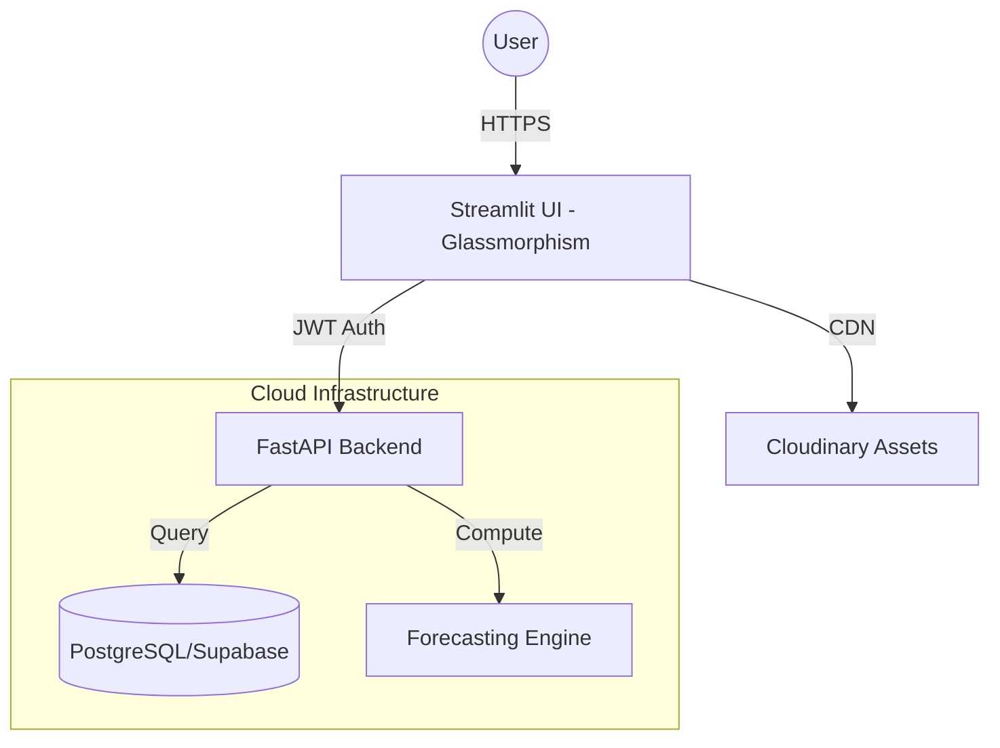

# ⚡ AstralytiQ - Enterprise MLOps & Sales Intelligence Platform

[](https://astralytiq.streamlit.app)
[](https://fastapi.tiangolo.com)
[](https://www.docker.com/)
[](https://opensource.org/licenses/MIT)
[](https://www.python.org/downloads/)

> **AstralytiQ** is a high-performance, production-grade MLOps platform designed for enterprise sales forecasting and resource intelligence. It bridges the gap between complex ML models and actionable business insights through a sleek, unified SaaS interface.

---

## 🌟 Key Features

### 🏢 Enterprise Core
- **Role-Based Access Control (RBAC)**: Fine-grained permissions for Admins, Data Scientists, and Business Analysts.
- **Secure Authentication**: JWT-based session management with Supabase/PostgreSQL integration.
- **Microservices Ready**: Decoupled frontend (Streamlit) and backend (FastAPI) architecture.

### 🤖 ML & Data Intelligence
- **Lifecycle Management**: Track models from training to deployment with automated performance metrics (Accuracy, F1, Recall).
- **Data Governance**: Monitor dataset health, quality scores, and processing pipelines (CSV, Parquet, Delta Lake).
- **Real-time Analytics**: High-fidelity Plotly visualizations for sales trends and predictive forecasting.

### 🔍 Operational Excellence
- **Live System Monitoring**: Real-time tracking of CPU/Memory usage and API response latencies.
- **Hybrid Infrastructure**: Deployable across GCP (Cloud Run), AWS (ECS), and Azure (Pipelines).
- **Dockerized Workflow**: Consistent development and production environments using multi-stage Docker builds.

---

## 🛠️ Tech Stack

| Layer | Technology |
| :--- | :--- |
| **Frontend** | Streamlit, Plotly, Custom CSS3 (Glassmorphism) |
| **API Backend** | FastAPI, Pydantic |
| **Database** | PostgreSQL, Supabase |
| **ML/Data** | Scikit-learn, Pandas, NumPy, Prophet |
| **DevOps** | Docker, Docker Compose, GitHub Actions |
| **Cloud** | GCP (Cloud Run, Cloud Build), AWS, Azure |

---

## 🚀 Quick Start

### 🏁 Production-Grade Local Setup
```bash
# 1. Clone & Navigate
git clone https://github.com/Aisenh037/astralytiq.git
cd astralytiq

# 2. Environment Configuration
cp .env.example .env  # Update your keys

# 3. Launch with Docker (Recommended)
docker-compose --profile full-stack up -d
```
*Access the platform at `http://localhost:8501`*

### 🐍 Manual Python Setup
```bash
python -m venv venv
source venv/bin/activate  # Windows: venv\Scripts\activate
pip install -r requirements.txt
streamlit run app.py
```

---

## 🔐 Enterprise Access (Demo)
| Role | Email | Password |
| :--- | :--- | :--- |
| **Admin** | `admin@astralytiq.com` | `admin123` |
| **Scientist** | `data.scientist@astralytiq.com` | `ds123` |
| **Analyst** | `analyst@astralytiq.com` | `analyst123` |

---

## 🏗️ System Architecture



---

## 📈 Roadmap & MVP Progress
- [x] **Phase 1**: Core MLOps Dashboard & RBAC
- [x] **Phase 2**: FastAPI Integration & Live Monitoring
- [x] **Phase 3**: Multi-Cloud Deployment Scripts
- [ ] **Phase 4**: Automated Model Retraining Pipelines (Coming Soon)
- [ ] **Phase 5**: Advanced Anomaly Detection (Coming Soon)

---

## 🤝 Contributing
We welcome contributions! Please see our [Contributing Guide](docs/contributing.md) for details on code style and pull request processes.

## 📖 Project Wiki
Detailed technical documentation and onboarding guides can be found in our **[Project Wiki](wiki/Home.md)**:
- [Onboarding for Data Scientists](wiki/Data-Scientist-Onboarding.md)
- [Database Schema Design](wiki/Database-Design.md)
- [Architecture Deep Dive](ARCHITECTURE.md)
- [Docker Deployment Strategy](wiki/Docker-Strategy.md)

## 📄 License
This project is licensed under the MIT License - see the [LICENSE](LICENSE) file for details.

---
<div align="center">
  <sub>Built with ❤️ by the AstralytiQ Engineering Team</sub>
</div>
